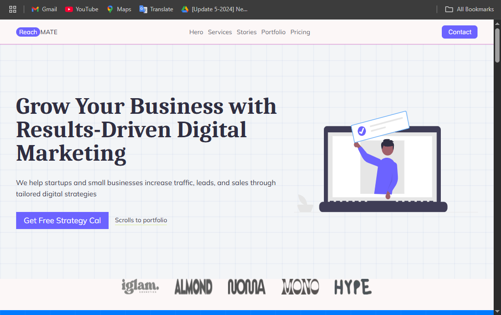

# 🚀 Digital Marketing Agency Landing Page

A modern, responsive, and conversion-focused landing page built for a fictional digital marketing agency. This project was designed to showcase high-quality UI/UX, clean code structure, and a strategy-driven layout that can be easily adapted for real-world clients.

---

## ✨ Features

- ⚡ Clean & professional layout
- ✅ Fully responsive on mobile, tablet, and desktop
- 🧩 Modular and maintainable structure
- 🎯 Conversion-optimized sections (Hero, Services, Testimonials, Case Studies, Pricing, FAQ, CTA)
- 🎨 Designed in Figma, developed with Tailwind CSS

---

## 📸 Preview

 <!-- Replace with actual screenshot if available -->

---

## 🔧 Built With

- **HTML5**
- **Tailwind CSS**
- **Figma** (for design)
- **React.js** / **Next.js** (optional if applicable)
- **Responsive Web Design Principles**

---

## 📁 Folder Structure (if applicable)

## 🧠 What I Learned

- How to structure a marketing website for lead generation
- Improving responsive layout skills with Tailwind
- Designing clean and reusable components
- Translating Figma designs to production-ready frontend code

---

## 📌 Use Case

This layout is ideal for:
- Marketing Agencies
- SaaS Landing Pages
- Service-based businesses
- Freelancers and portfolio websites

---

## 📞 Let's Connect

If you like this project and want something similar for your brand or client — feel free to reach out!

**Built with 💻 by Yusuf Ali**
